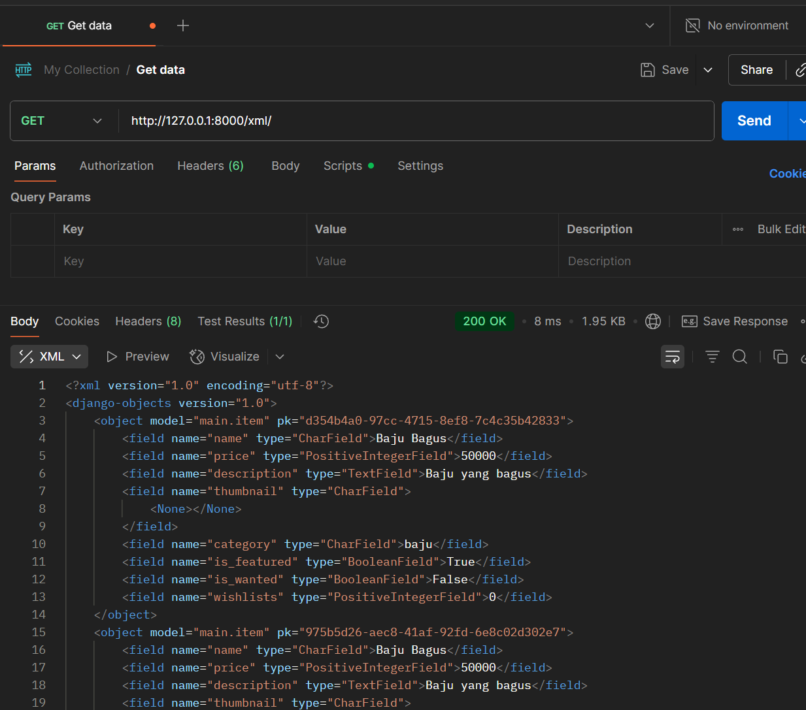

⚽ Wolverhampton Shop - Proyek Django

Selamat datang di repositori Wolverhampton Shop, sebuah aplikasi web e-commerce sederhana yang dibangun menggunakan framework Django. Proyek ini dikembangkan sebagai bagian dari tugas mata kuliah Pengembangan Berbasis Platform (PBP).

## Tugas Individu 3

**[🔗 Kunjungi Aplikasi yang Sudah Deploy](https://prasetya-surya-footballshop.pbp.cs.ui.ac.id/)**

# Langkah-Langkah Implementasi

## 1. Tambahkan 4 fungsi `views` baru untuk melihat objek yang sudah ditambahkan dalam format XML, JSON, XML by ID, dan JSON by ID.
Pertama, saya membuat 4 fungsi yang menerima argumen `request` dan `product_id` (untuk fungsi show_..._get_by_id) berikut di `views.py`:
1. `show_json`
2. `show_xml`
3. `show_xml_by_id`
4. `show_json_by_id`

Keempat fungsi tersebut sebenarnya memiliki struktur yang mirip sekali. Urutan bagaimana saya mengimplementasi fungsi fungsi tersebut adalah:
1. Mengambil list produk dari database atau hanya mengambil satu produk berdasarkan ID dengan baris `product_list = Item.objects.all()` atau `product = Item.objects.filter(pk = product_id)`
2. Mengubah data tersebut menjadi data XML atau JSON dengan `serializers.serialize("json"/"xml", product_list/product)`
3. Return data tersebut dengan HttpResponse dengan `content_type = application/json` atau `content_type = application/xml`

## 2. Membuat routing URL untuk masing-masing views yang telah ditambahkan
1. Menambahkan `path('/xml', show_xml, name='show_xml')` ke urlpattern di `main/urls.py`
2. Menambahkan `path('/json', show_json, name='show_json')` ke urlpattern di `main/urls.py`
3. Menambahkan `path('/xml/<str:product_id>/', show_xml_by_id, name='show_xml_by_id')` ke urlpattern di `main/urls.py`. `<str:product_id>` mensinyalkan bahwa apabila ada string setelah `xml/` berarti ambil string itu dan jadikan argumen `product_id` di fungsi `show_xml_by_id`
4. Menambahkan `path('/json/<str:product_id>/', show_json_by_id, name='show_json_by_id')` ke urlpattern di `main/urls.py`. `<str:product_id>` mensinyalkan bahwa apabila ada string setelah `json/` berarti ambil string itu dan jadikan argumen `product_id` di fungsi `show_json_by_id`

## 3 .Membuat halaman yang menampilkan data objek model yang memiliki tombol "Add" yang akan redirect ke halaman form, serta tombol "Detail" pada setiap data objek model yang akan menampilkan halaman detail objek.
1. Memperbarui `main.html` agar dapat menampilkan data objek model. Perhatikan bahwa `base.html` adalah template HTML yang digunakan untuk merender page. 
2. Untuk tombol "Add" yang redirect ke halaman form. Kita buat tag button di dalam tag link dengan href dengan nama yang sesuai dengan yang didefinisikan di `urls.py` misalnya karena kita ingin redirect ke halaman form, maka untuk merender page form kita harus ke url `.../create-product` yang didefinisikan dengan nama `create_product` di `urls.py`, karena itulah href dari link untuk tombol "Add Product" adalah `url 'main:create_product'`. Hal yang sama berlaku untuk tombol "Detail"
3. Untuk menampilkan data object, kita akan menampilkan dengan tag-tag HTML. Fungsi `show_main` di `views` mengambil data dari Model dan menggabungkan data tersebut dengan `main.html` untuk dirender

### `main.html`
```html



<h1> {{ shopName }}</h1>

<h2>Nama: </h2>
<p>{{ nama }}</p>

<h3>Kelas: </h3>
<p> {{ kelas }}</p>

<a href="">
    <button>+Add Product</button>
</a>

<hr>


<p>Belum ada data produk pada {{ shopName }}</p>



    <div>
        <h2><a href="">{{ product.name }}</a></h2>
        
        
        <br />
        
        
        <p>{{ product.description|truncatewords:25}}...</p>

        <p><a href=""><button>Detail</button></a></p>
    
    </div>




```

## Membuat halaman `form` untuk menambahkan objek model pada app sebelumnya
1. Pertama, saya mengimport `ModelForm` dari library Django lalu membuat `forms.py` dan membuat class ProductForm yang akan inherit ModelForm. ProductForm dibuat untuk memudahkan rendering table di HTML karena terautomasi, kita hanya perlu memberi tahu apa attribut Model yang ingin kita input.

### `forms.py`
```python
from django.forms import ModelForm
from main.models import Item

class ProductForm(ModelForm):
    class Meta:
        model = Item
        fields = ["name", "price", "description","category", "thumbnail", "is_featured"]
```

2. Membuat `create_product.html` yaitu halaman `form` yang akan digunakan untuk menginput data

### `create_product.html`
```html


<h1>Add Product</h1>

<form action="" method="POST">
    
    <table>
        {{ form.as_table }}
        <tr>
            <td></td>
            <td>
                <input type="submit" value="Add Product">
            </td>
        </tr>
    </table>
</form>


```

3. Membuat fungsi `create_product` yang dipanggil ketika mengunjungi halaman form. Fungsi tersebut akan memvalidasi data dan menyimpan data ke basis data apabila lolos validasi. Apabila form belum disubmit maka data-data yang dimasukkan di form masih sementara dan belum disimpan ke basis data. Apabila form sudah disubmit maka akan ada validasi data data yang dimasukkan terlebih dahulu sebelum disimpan ke basis data.

4. Apabila data sudah selesai menyimpan data ke basis data maka akan meredirect ke halaman `main.html`

### `create_product`
```python
def create_product(request):
    form = ProductForm(request.POST or None)

    if form.is_valid() and request.method == "POST":
        form.save()
        return redirect('main:show_main')
    
    context = {'form': form}
    return render(request, "create_product.html", context)
```

## 4. Membuat halaman yang menampilkan detail dari setiap data objek model
1. Membuat `product_detail.html` sebagai halaman yang akan menampilkan detail dari setiap data objek model, seperti nama, harga, dan lain-lain.

### `product_detail.html`
```html


<p><a href=""><button>← Back to News List</button></a></p>


<h1>{{ product.name }}</h1>



<br /> <br />


<p><b>{{ product.get_category_display }} </b> |
    <b>Featured</b> |
    <b>Frequently Wishlisted</b> 
</p>

<h3>{{ product.price }}</h3>

<p>{{ product.description }}</p>


```

2. Membuat fungsi `show_product` di `views` untuk merender detail dari objek model. Fungsi tersebut akan meminta suatu product berdasarkan product id dari basis data dan menggabungkan data dari product tersebut dengan `product_detail.html`


### `show_product`
```python
def show_product(request, product_id):
    product = get_object_or_404(Item, pk=product_id)

    context = {'product': product}

    return render(request, "product_detail.html", context)
```

---

## Jelaskan mengapa kita memerlukan data delivery dalam pengimplementasian sebuah platform?
Data delivery diperlukan karena untuk mengimplementasikan platform yang membutuhkan data akurat untuk beroperasi. Jika tidak ada data atau datanya tidak akurat maka platform tidak akan bekerja dengan tepat

## Menurutmu, mana yang lebih baik antara XML dan JSON? Mengapa JSON lebih populer dibandingkan XML?
Menurut saya JSON lebih baik karena mudah dibaca karena memakai notasi objek javascript yang memiliki key value pair dibandingkan xml yang lumayan verbose. Selain itu, datanya mudah di kelola karena didukung oleh JS yang merupakan bahasa pemrograman utama untuk website.

## Jelaskan fungsi dari method is_valid() pada form Django dan mengapa kita membutuhkan method tersebut?
Method is_valid() adalah method yang menentukan apakah data yang disubmit valid dan tidak melanggar aturan yang didefinisikan di model. Kita membutuhkan method tersebut supaya data dari form dipastikan valid untuk dimasukkan ke database.

## Mengapa kita membutuhkan csrf_token saat membuat form di Django?
Karena `csrf_token` ada untuk mencegah cyberattack Cross-Site Request Forgery (CSRF). Jadi tidak ada yang bisa mengirimkan data ke server tanpa csrf_token yang benar. Apabila kita tidak menambahkan `csrf_token` pada form kita maka situs akan rentan terkena serangan CSRF. Tanpa token tersebut, server Django tidak memiliki cara untuk memverifikasi apakah sebuah request benar benar dari situs yang benar atau situs yang jahat. Penjahat dapat memanfaatkan hal tersebut dengan cara melakukan sebuah transaksi tanpa izin atas nama korban dengan membuat sebuah form yang mirip dengan form transfer dari sebuah metode pembayaran dann membuat korban mengunjungi situs tersebut, saat situs dikunjungi maka ada sebuah form yang otomatis tersubmit yang adalah sebuah request misalnya untuk transfer, karena korban mengunjungi situs tersebut dari browsernya, server metode pembayaran tersebut menganggap bahwa request tersebut benar-benar dilakukan oleh korban.

---

## POSTMAN

`/json`


`/xml`


`/json/product_id`


`/xml/product_id`
